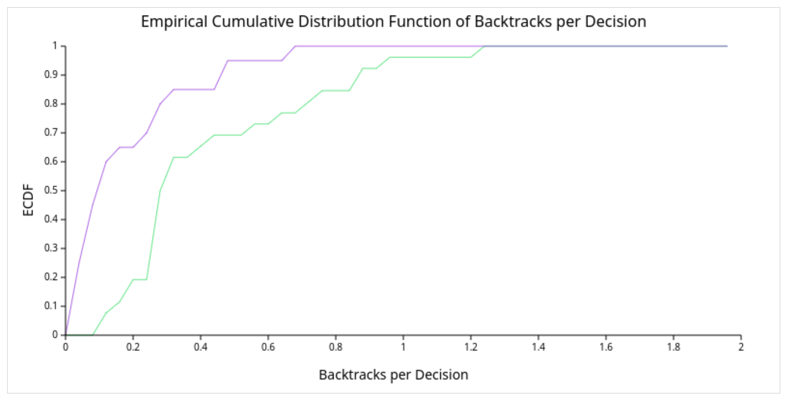
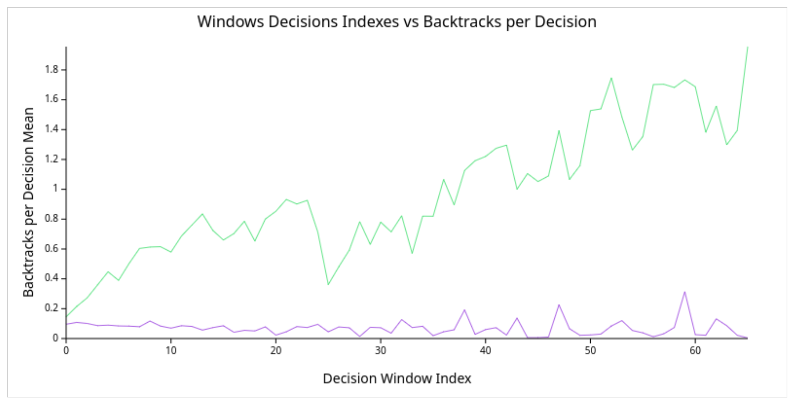
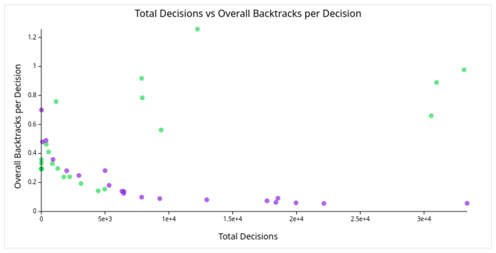
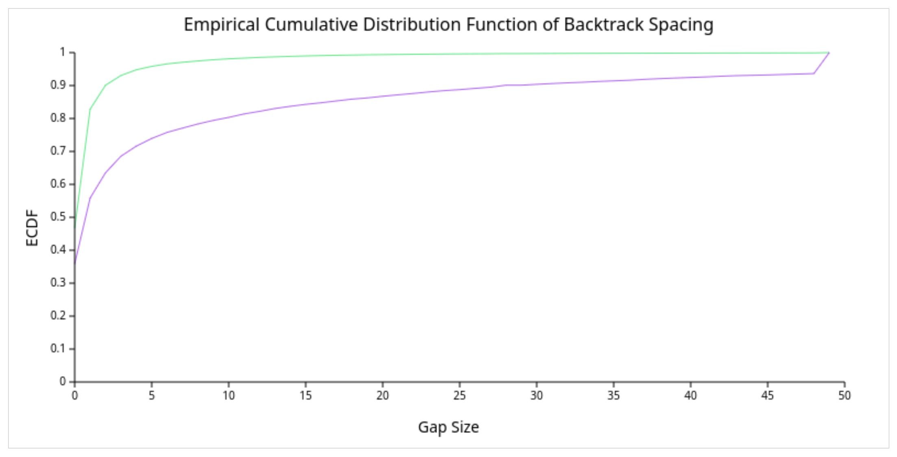
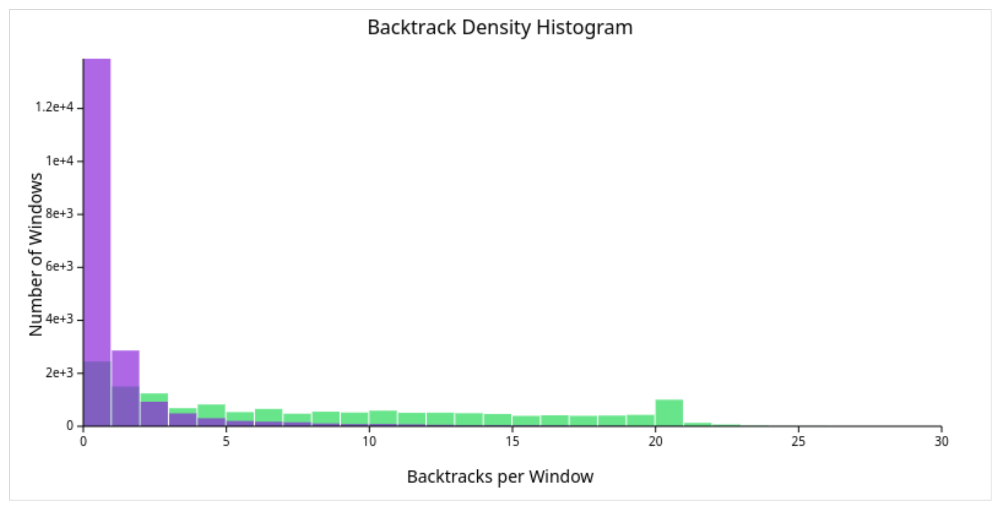
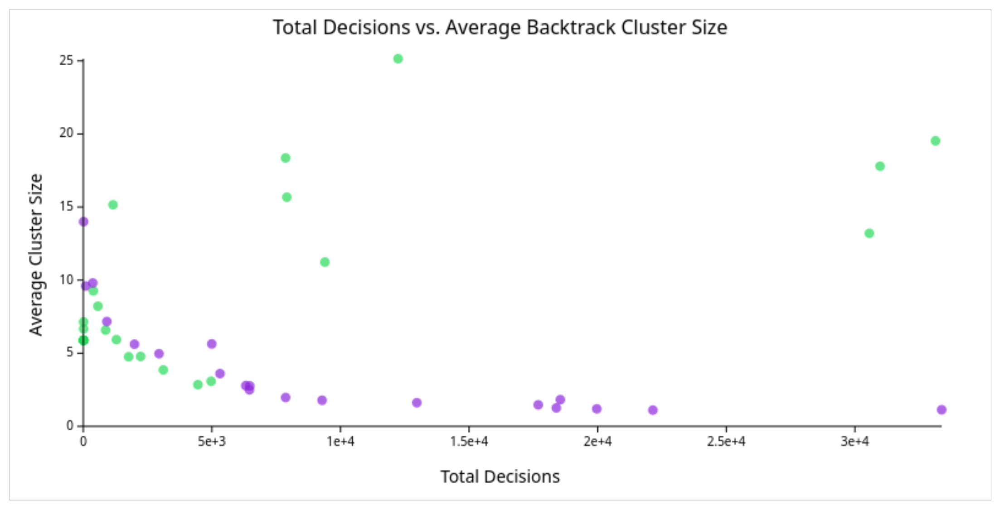
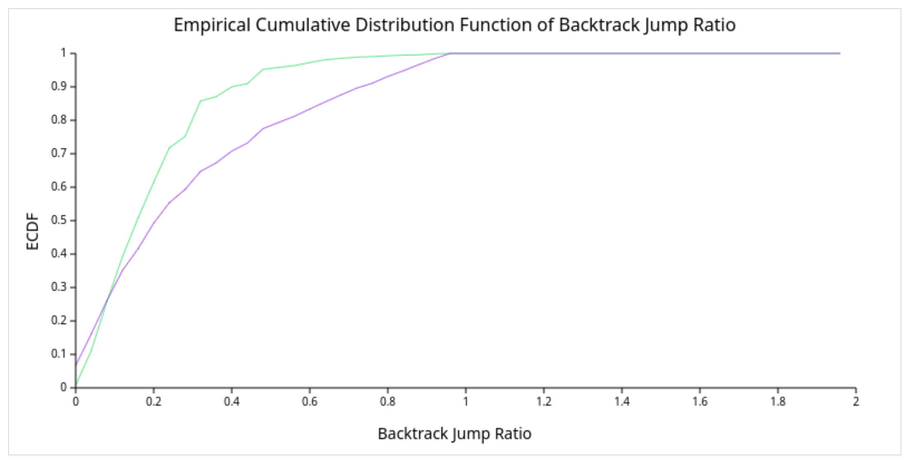
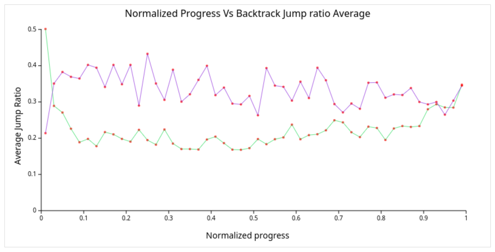
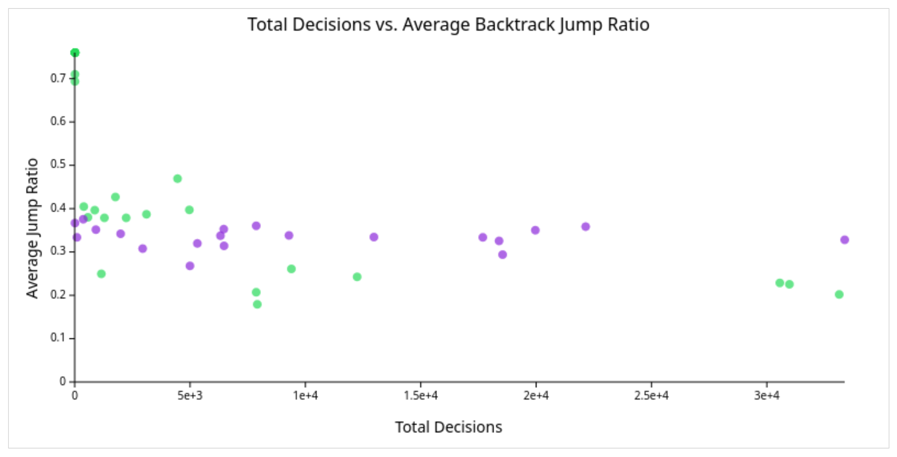

# User Documentation: Yaga Solver Log Visualizer
## Overview
This tool allows users to visualize internal metrics and events collected from the [Yaga SMT solver](https://github.com/d3sformal/yaga). It is a fork of the original repository that adds two components: 
* A Yaga extension that logs important solver events into a CSV file. 
* Web Dashboard: A browser-based app for visualizing those logs in the form of charts.

## Prerequisities
* C++ compiler (`gcc`, `clang`) with C++20 support
* `cmake` version at least 3.17
* `flex` version at least 2.6
* `Node.js` version at least 16 (npm is included automatically)  

## Build
### Enabling logging
To build Yaga with the logging option, first enable it in the CMake file. Add/uncomment the following lines at the end of `CMakeLists.txt`:

```cmake
# Enable logging for all visualized logs (recommended for visualization)
target_compile_definitions(yaga PRIVATE LOG_TRASHING LOG_SHALLOW_BACKTRACKS LOG_BACKTRACK_CLUSTERING)
target_compile_definitions(test PRIVATE LOG_TRASHING LOG_SHALLOW_BACKTRACKS LOG_BACKTRACK_CLUSTERING)
target_compile_definitions(sat PRIVATE LOG_TRASHING LOG_SHALLOW_BACKTRACKS LOG_BACKTRACK_CLUSTERING)
target_compile_definitions(smt PRIVATE LOG_TRASHING LOG_SHALLOW_BACKTRACKS LOG_BACKTRACK_CLUSTERING)
```
Alternatively, you can customize which events are logged, for example:
```cmake
# Enable logging of all available logs (less recommended for visualization due to performance)
target_compile_definitions(yaga PRIVATE LOG_ALL)
target_compile_definitions(test PRIVATE LOG_ALL)
target_compile_definitions(sat PRIVATE LOG_ALL)
target_compile_definitions(smt PRIVATE LOG_ALL)
```

The options provided are;

* `LOG_ALL` -- enables all implemented logs
* `LOG_TRASHING` -- enables logs relevant for analysis of trashing behaviour
* `LOG_BACKTRACK_CLUSTERING` -- enables logs relevant for the detection of tight backtrack clusters
* `LOG_SHALLOW_BACKTRACKS` -- enables logs relevant for analysis of shallow backtracks

### Building Yaga

Now build Yaga normally. Run the following commands:

1. `mkdir build-release`
2. `cd build-release`
3. `cmake -DCMAKE_BUILD_TYPE=Release ..`
4. `make` 

You can use a different build system in step `3`. For example, `cmake -DCMAKE_BUILD_TYPE=Release -G Ninja ..` creates build files for the [Ninja build system](https://ninja-build.org/) which you can use in the 4th step by running `ninja` instead of `make`.

Building the project creates `test`, `sat` and `smt` executables. The `sat` utility implements a SAT solver using core of the MCSat framework and a plugin for Boolean variables. It has one command line argument which is a path to a CNF formula in the [DIMACS format](https://www.cs.utexas.edu/users/moore/acl2/manuals/current/manual/index-seo.php/SATLINK____DIMACS).
The `smt` utility implements an SMT solver capable of solving problem in quantifier-free linear real arithmetic (QF_LRA logic in SMT-LIB terminology).
It has one command line argument which is a path to a SMT-LIB2 file.
Yaga supports a subset of SMT-LIB2 language that covers all non-incremental benchmarks in SMT-LIB for QF_LRA.

### Building the visualizer

To build and run the browser-based visualizer, run:
```sh
cd metrics-visualizer
npm install
npm run dev
```


This installs all required dependencies into the `node_modules` folder, including [Svelte](https://svelte.dev/) and its official [Vite](https://vite.dev/) plugin, [Papa Parse](https://www.papaparse.com/) (CSV parsing), [file‑saver](https://github.com/eligrey/FileSaver.js), [html2canvas](https://html2canvas.hertzen.com/), [JSZip](https://stuk.github.io/jszip/) and the project’s build‑time and editor support (TypeScript and Svelte type definitions).

You should see output similar to:

```
VITE v6.3.5  ready in 726 ms

➜  Local:   http://localhost:5173/
➜  Network: use --host to expose
➜  press h + enter to show help
```


## Running
1. Run the generated executable `smt` (located in the `build-release` directory) on a required benchmark

This creates a CSV log file `metrics.csv` in your current folder.

2. Open your browser and navigate to the Local development server URL that was printed in the console in the previous step to view the web application.

For batch runs, the following one-liner is useful:
```sh
for i in <directory-with-benchmarks>/*.smt2; do build-release/smt $i; mv measurements.csv $i.csv; done
```

## Using the Web Dashboard
This section describes how the web application can be used to display the required charts after the user opens it in a browser.
### Uploading CSV Files
- Upload the CSV using the Browse button
- Only CSV files are allowed
- File uploads can be done repeatedly. One upload of CSV files automatically creates a file group and lists it in the dashboard with its assigned color, which is later used in charts as color for this group's data.
- The same file can be used in multiple group uploads by simply adding it for each one.
- CSV files with the same name, last modified, and size metadata are treated as uploading the same file.
- Once at least one file upload is finished, the chart selection section is displayed.

### Chart Selection, Generation and Download
- Use checkboxes to select charts to generate. This selection displays charts' canvases to keep better track of how many charts will be generated.
- These checkboxes are divided into three sections according to the analyzed solver's behaviour: `Trashing Analysis`, `Backtrack Burst Clusters`, and `Shallow Backtracks`
- The charts on canvases are generated after clicking the `Generate` button.
- Each chart visualizes data across all selected files.
- Each file group is displayed as a separate color group in the chart for better comparison.
- Once the charts are generated, you can download the files using the `Download Chart Images` button

## Chart Types
Here are the types of charts that the application can show, grouped according to the solver behavior they help analyze.

### Trashing Analysis
These charts help detect when the solver is doing a lot of backtracking compared to making progress.

#### Empirical Cumulative Distribution Function (ECDF) of Backtracks per Decision
Shows the distribution of backtracks per decision (BT/D) across solver runs.



#### Decision Window Index vs Backtracks per Decision
Displays when trashing happens during the search by showing median Backtracks per Decision per a fixed-size decision window.

  

#### Total Decisions vs. Overall Backtracks per Decision
Each point is a solver run. It shows how much progress the solver made compared to Backtracks per Decision.

  

### Backtrack Burst Clusters
These charts help identify if backtracks are happening in tightly packed clusters.

#### Empirical Cumulative Distribution Function (ECDF) of Backtrack Spacing
Shows the distribution of the decision gaps between backtracks.




#### Backtrack Density Histogram
Shows how often decision windows contain a certain number of backtracks.


   
#### Total Decisions vs. Average Cluster Size
Shows average cluster size as the solver's search progresses.

  

### Shallow Backtracks
These charts help detect shallow backtracks, which are the ones that undo only a small number of assignments. The chart descriptions often use a term jump ratio, which is the number of assignments removed divided by the trail size before the backtrack.

#### Empirical Cumulative Distribution Function (ECDF) of Backtrack Jump Ratio
Shows the distribution of the backtrack jump ratios.



#### Progress vs. Average Jump Ratio
Line chart showing how the average jump ratio evolves as the solver makes progress.



#### Total Decisions vs. Average Jump Ratio
Shows whether shallow backtracking correlates with longer solver runs



## CSV File Format
Produced metrics logs are stored in a CSV log file `metrics.csv`.

Each line has a format of:

```
<origin>,<event>,<values...>
```

* `origin` – describes the part of the solver from which the event is logged. There are four types of origins so far: `core` for SAT core, `bool` for the Boolean theory plugin, `lra` for the linear real arithmetic plugin, and `func` for the uninterpreted functions plugin.
* `event` – identifies the event type, for example `decision`, `after_propagation`, `conflict`, and more.
* `values` – values relevant to the logged event. 


An example of a log file:

```
core,decision,8,1,2,1,0
core,decision,9,2,3,2,0
core,decision,4,3,4,3,0
core,decision,5,4,5,4,0
core,before_backtrack,4,5,4
core,after_backtrack,2,3,UIP
core,decision,5,3,4,5,1
core,decision,4,4,5,6,1
core,decision,3,5,6,7,1
core,before_backtrack,5,6,7
core,after_backtrack,2,3,UIP
core,decision,4,3,4,8,2
core,before_backtrack,3,4,8
core,after_backtrack,2,3,UIP
core,decision,4,3,4,9,3
core,before_backtrack,3,4,9
core,after_backtrack,2,3,UIP
core,before_backtrack,2,3,9
core,after_backtrack,1,2,UIP
core,decision,4,2,3,10,5
core,before_backtrack,2,3,10
core,after_backtrack,1,2,UIP
core,before_backtrack,1,2,10
core,after_backtrack,0,1,UIP
core,search_end,0,1,7,8,8,10,7
```
## Additional information
- Files are parsed in 6 KB chunks to maintain responsiveness.
- Charts' constants were set to handle datasets of medium verbosity. For other cases you might want to adjust constants located in chart components' files under `CONSTANTS` comment to get smoother result.
